# Time of Concentration and Lag Time Plugin

<!DOCTYPE HTML PUBLIC "-//W3C//DTD HTML 4.0//EN" "http://www.w3.org/TR/REC-html40/strict.dtd">
<html><head><meta name="qrichtext" content="1" /></head><body style=" font-family:'MS Shell Dlg 2'; font-size:8.25pt; font-weight:400; font-style:normal;">

Time of concentration and lag time plugin 

  

In a hydrological modelling framework, this plugin applies different empirical equations to estimate time of concentration and lag time. The plugin works from a shape file provided by the user, typically representing basins. The user assigns the corresponding attributes to the variables required for calculus of such times. Then, based on the provided attributes, the plugin exclusively enables the computable equations in both time of concentration and lag time, depending on the selected parameters. The table below presents the required parameters for calculating the different equations, also shown below. 

Time of concentration: 

it is the time required for surface runoff from the farthest point of the basin to reach the outlet point is considered, i.e., the time at which the entire hydrographic unit contributes to the flow. For calculation, you can use different formulas that relate to other parameters typical of the basin. For the estimation of time of concentration, it is recommended to use several empirical equations available in the scientific literature, it is considered appropriate to include at least five estimators (SCS, The Soil Conservation Service, 2010). 

 

<table border="1" style=" margin-top:0px; margin-bottom:0px; margin-left:0px; margin-right:0px;" align="center" width="512" cellspacing="0" cellpadding="0">
<tr>
<td width="160" style=" padding-left:0; padding-right:0; padding-top:0; padding-bottom:0;">

Time of concentration 
</td>
<td width="187" style=" padding-left:0; padding-right:0; padding-top:0; padding-bottom:0;">

Equation 
</td>
<td width="164" style=" padding-left:0; padding-right:0; padding-top:0; padding-bottom:0;">

Parameters 
</td></tr>
<tr>
<td style=" padding-left:0; padding-right:0; padding-top:0; padding-bottom:0;">

WILLIAMS 
</td>
<td style=" padding-left:0; padding-right:0; padding-top:0; padding-bottom:0;">

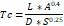
<html><head><meta name="qrichtext" content="1" /></head><body style=" font-family:'MS Shell Dlg 2'; font-size:8.25pt; font-weight:400; font-style:normal;">

Time of concentration and lag time plugin 

  

In a hydrological modelling framework, this plugin applies different empirical equations to estimate time of concentration and lag time. The plugin works from a shape file provided by the user, typically representing basins. The user assigns the corresponding attributes to the variables required for calculus of such times. Then, based on the provided attributes, the plugin exclusively enables the computable equations in both time of concentration and lag time, depending on the selected parameters. The table below presents the required parameters for calculating the different equations, also shown below. 

Time of concentration: 

it is the time required for surface runoff from the farthest point of the basin to reach the outlet point is considered, i.e., the time at which the entire hydrographic unit contributes to the flow. For calculation, you can use different formulas that relate to other parameters typical of the basin. For the estimation of time of concentration, it is recommended to use several empirical equations available in the scientific literature, it is considered appropriate to include at least five estimators (SCS, The Soil Conservation Service, 2010). 

 

<table border="1" style=" margin-top:0px; margin-bottom:0px; margin-left:0px; margin-right:0px;" align="center" width="512" cellspacing="0" cellpadding="0">
<tr>
<td width="160" style=" padding-left:0; padding-right:0; padding-top:0; padding-bottom:0;">

Time of concentration 
</td>
<td width="187" style=" padding-left:0; padding-right:0; padding-top:0; padding-bottom:0;">

Equation 
</td>
<td width="164" style=" padding-left:0; padding-right:0; padding-top:0; padding-bottom:0;">

Parameters 
</td></tr>
<tr>
<td style=" padding-left:0; padding-right:0; padding-top:0; padding-bottom:0;">

WILLIAMS 
</td>
<td style=" padding-left:0; padding-right:0; padding-top:0; padding-bottom:0;">

 
</td>
<td rowspan="8" style=" padding-left:0; padding-right:0; padding-top:0; padding-bottom:0;">

Basin Area 

Length of the main channel Average slope of the basin 
</td></tr>
<tr>
<td style=" padding-left:0; padding-right:0; padding-top:0; padding-bottom:0;">

KIRPICH 
</td>
<td style=" padding-left:0; padding-right:0; padding-top:0; padding-bottom:0;">

 
</td></tr>
<tr>
<td style=" padding-left:0; padding-right:0; padding-top:0; padding-bottom:0;">

CLARK 
</td>
<td style=" padding-left:0; padding-right:0; padding-top:0; padding-bottom:0;">

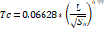 
</td></tr>
<tr>
<td style=" padding-left:0; padding-right:0; padding-top:0; padding-bottom:0;">

TEMEZ 
</td>
<td style=" padding-left:0; padding-right:0; padding-top:0; padding-bottom:0;">

 
</td></tr>
<tr>
<td style=" padding-left:0; padding-right:0; padding-top:0; padding-bottom:0;">

PILGRIM 
</td>
<td style=" padding-left:0; padding-right:0; padding-top:0; padding-bottom:0;">

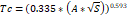 
</td></tr>
<tr>
<td style=" padding-left:0; padding-right:0; padding-top:0; padding-bottom:0;">

VALENCIA Y ZULUAGA 
</td>
<td style=" padding-left:0; padding-right:0; padding-top:0; padding-bottom:0;">

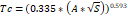 
</td></tr>
<tr>
<td style=" padding-left:0; padding-right:0; padding-top:0; padding-bottom:0;">

VENTURA-HERAS 
</td>
<td style=" padding-left:0; padding-right:0; padding-top:0; padding-bottom:0;">

 
</td></tr>
<tr>
<td style=" padding-left:0; padding-right:0; padding-top:0; padding-bottom:0;">

BRANSBY - WILLIAMS 
</td>
<td style=" padding-left:0; padding-right:0; padding-top:0; padding-bottom:0;">

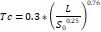 
</td></tr>
<tr>
<td style=" padding-left:0; padding-right:0; padding-top:0; padding-bottom:0;">

SCS 
</td>
<td style=" padding-left:0; padding-right:0; padding-top:0; padding-bottom:0;">

 
</td>
<td style=" padding-left:0; padding-right:0; padding-top:0; padding-bottom:0;">

Curve number 
</td></tr>
<tr>
<td style=" padding-left:0; padding-right:0; padding-top:0; padding-bottom:0;">

CALIFORNIA CULVERT PRACTICE 
</td>
<td style=" padding-left:0; padding-right:0; padding-top:0; padding-bottom:0;">

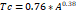 
</td>
<td style=" padding-left:0; padding-right:0; padding-top:0; padding-bottom:0;">

Height Delta (maximum dimension - minimum dimension) 
</td></tr>
<tr>
<td style=" padding-left:0; padding-right:0; padding-top:0; padding-bottom:0;">

SCS - RANSER 
</td>
<td style=" padding-left:0; padding-right:0; padding-top:0; padding-bottom:0;">

 
</td>
<td style=" padding-left:0; padding-right:0; padding-top:0; padding-bottom:0;">

Height Delta (maximum dimension - minimum dimension) 
</td></tr>
<tr>
<td style=" padding-left:0; padding-right:0; padding-top:0; padding-bottom:0;">

GIANDOTTI 
</td>
<td style=" padding-left:0; padding-right:0; padding-top:0; padding-bottom:0;">

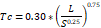 
</td>
<td style=" padding-left:0; padding-right:0; padding-top:0; padding-bottom:0;">

Height Delta (maximum dimension - minimum dimension) 
</td></tr></table>

  

  

Lag time: 

it corresponds to the time between precipitation and the maximum flow of the hydrographic unit, representing the rain delay time (Velez &amp; Botero, 2011).This variable depends mainly on the length and unevenness of the channel, in addition, on the geomorphological characteristics of the basin and the magnitude of runoff. 

 

<table border="1" style=" margin-top:0px; margin-bottom:0px; margin-left:0px; margin-right:0px;" align="center" width="489" cellspacing="0" cellpadding="0">
<tr>
<td width="160" style=" padding-left:0; padding-right:0; padding-top:0; padding-bottom:0;">

Lag Time 
</td>
<td width="164" style=" padding-left:0; padding-right:0; padding-top:0; padding-bottom:0;">

Equation 
</td>
<td width="164" style=" padding-left:0; padding-right:0; padding-top:0; padding-bottom:0;">

Parameter 
</td></tr>
<tr>
<td style=" padding-left:0; padding-right:0; padding-top:0; padding-bottom:0;">

EAGLESON 
</td>
<td style=" padding-left:0; padding-right:0; padding-top:0; padding-bottom:0;">

 
</td>
<td rowspan="3" style=" padding-left:0; padding-right:0; padding-top:0; padding-bottom:0;">

Basin area Main channel length Average watershed slope 
</td></tr>
<tr>
<td style=" padding-left:0; padding-right:0; padding-top:0; padding-bottom:0;">

SNYDER 
</td>
<td style=" padding-left:0; padding-right:0; padding-top:0; padding-bottom:0;">

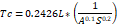 
</td></tr>
<tr>
<td style=" padding-left:0; padding-right:0; padding-top:0; padding-bottom:0;">

CHOW 
</td>
<td style=" padding-left:0; padding-right:0; padding-top:0; padding-bottom:0;">

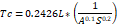 
</td></tr>
<tr>
<td style=" padding-left:0; padding-right:0; padding-top:0; padding-bottom:0;">

SCS 
</td>
<td style=" padding-left:0; padding-right:0; padding-top:0; padding-bottom:0;">

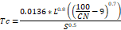 
</td>
<td style=" padding-left:0; padding-right:0; padding-top:0; padding-bottom:0;">

Curve number 
</td></tr>
<tr>
<td style=" padding-left:0; padding-right:0; padding-top:0; padding-bottom:0;">

PUTMAN 
</td>
<td style=" padding-left:0; padding-right:0; padding-top:0; padding-bottom:0;">

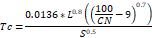 
</td>
<td style=" padding-left:0; padding-right:0; padding-top:0; padding-bottom:0;">

Permeability coefficient 
</td></tr></table>

  

Results: 

with the purpose of make the results more readable and provide more significant data visualization, the plugin adds the resulted layer to the QGIS view considering a default thematic classification by applying five categories and labelling the most significant method for the estimation of time of concentration and Lag time. The selection of the most significant method is relied on statisticians as mean, standard deviation and trimean. 

The classification is based on Natural Breaks (Jenks) and shows the times of concentration calculated. This way, a shape file classified into five intervals showing the minimum and highest concentration is added to the view after processing the selected methods.  

To report failures or make suggestions, please contact <a href="mailto:joaherrerama@unal.edu.co">joaherrerama@unal.edu.co</a>. 

References List 

  

SCS, The Soil Conservation Service. (2010). Chapter 15 Time of Concentration. Hydrology National Engineering Handbook, 1, 1-12. 

 

Velez, J., &amp; Botero, A. (2011). Estimación del tiempo de concentración y tiempo de rezago en la cuenca experimental urbana de la quebrada San Luis, Manizales. Dyna, 78(65), 58-71. 
</body></html>"64" height="26" /> 
</td>
<td rowspan="8" style=" padding-left:0; padding-right:0; padding-top:0; padding-bottom:0;">

Basin Area 

Length of the main channel Average slope of the basin 
</td></tr>
<tr>
<td style=" padding-left:0; padding-right:0; padding-top:0; padding-bottom:0;">

KIRPICH 
</td>
<td style=" padding-left:0; padding-right:0; padding-top:0; padding-bottom:0;">

 
</td></tr>
<tr>
<td style=" padding-left:0; padding-right:0; padding-top:0; padding-bottom:0;">

CLARK 
</td>
<td style=" padding-left:0; padding-right:0; padding-top:0; padding-bottom:0;">

 
</td></tr>
<tr>
<td style=" padding-left:0; padding-right:0; padding-top:0; padding-bottom:0;">

TEMEZ 
</td>
<td style=" padding-left:0; padding-right:0; padding-top:0; padding-bottom:0;">

 
</td></tr>
<tr>
<td style=" padding-left:0; padding-right:0; padding-top:0; padding-bottom:0;">

PILGRIM 
</td>
<td style=" padding-left:0; padding-right:0; padding-top:0; padding-bottom:0;">

 
</td></tr>
<tr>
<td style=" padding-left:0; padding-right:0; padding-top:0; padding-bottom:0;">

VALENCIA Y ZULUAGA 
</td>
<td style=" padding-left:0; padding-right:0; padding-top:0; padding-bottom:0;">

 
</td></tr>
<tr>
<td style=" padding-left:0; padding-right:0; padding-top:0; padding-bottom:0;">

VENTURA-HERAS 
</td>
<td style=" padding-left:0; padding-right:0; padding-top:0; padding-bottom:0;">

 
</td></tr>
<tr>
<td style=" padding-left:0; padding-right:0; padding-top:0; padding-bottom:0;">

BRANSBY - WILLIAMS 
</td>
<td style=" padding-left:0; padding-right:0; padding-top:0; padding-bottom:0;">

 
</td></tr>
<tr>
<td style=" padding-left:0; padding-right:0; padding-top:0; padding-bottom:0;">

SCS 
</td>
<td style=" padding-left:0; padding-right:0; padding-top:0; padding-bottom:0;">

 
</td>
<td style=" padding-left:0; padding-right:0; padding-top:0; padding-bottom:0;">

Curve number 
</td></tr>
<tr>
<td style=" padding-left:0; padding-right:0; padding-top:0; padding-bottom:0;">

CALIFORNIA CULVERT PRACTICE 
</td>
<td style=" padding-left:0; padding-right:0; padding-top:0; padding-bottom:0;">

 
</td>
<td style=" padding-left:0; padding-right:0; padding-top:0; padding-bottom:0;">

Height Delta (maximum dimension - minimum dimension) 
</td></tr>
<tr>
<td style=" padding-left:0; padding-right:0; padding-top:0; padding-bottom:0;">

SCS - RANSER 
</td>
<td style=" padding-left:0; padding-right:0; padding-top:0; padding-bottom:0;">

 
</td>
<td style=" padding-left:0; padding-right:0; padding-top:0; padding-bottom:0;">

Height Delta (maximum dimension - minimum dimension) 
</td></tr>
<tr>
<td style=" padding-left:0; padding-right:0; padding-top:0; padding-bottom:0;">

GIANDOTTI 
</td>
<td style=" padding-left:0; padding-right:0; padding-top:0; padding-bottom:0;">

 
</td>
<td style=" padding-left:0; padding-right:0; padding-top:0; padding-bottom:0;">

Height Delta (maximum dimension - minimum dimension) 
</td></tr></table>

  

  

Lag time: 

it corresponds to the time between precipitation and the maximum flow of the hydrographic unit, representing the rain delay time (Velez &amp; Botero, 2011).This variable depends mainly on the length and unevenness of the channel, in addition, on the geomorphological characteristics of the basin and the magnitude of runoff. 

 

<table border="1" style=" margin-top:0px; margin-bottom:0px; margin-left:0px; margin-right:0px;" align="center" width="489" cellspacing="0" cellpadding="0">
<tr>
<td width="160" style=" padding-left:0; padding-right:0; padding-top:0; padding-bottom:0;">

Lag Time 
</td>
<td width="164" style=" padding-left:0; padding-right:0; padding-top:0; padding-bottom:0;">

Equation 
</td>
<td width="164" style=" padding-left:0; padding-right:0; padding-top:0; padding-bottom:0;">

Parameter 
</td></tr>
<tr>
<td style=" padding-left:0; padding-right:0; padding-top:0; padding-bottom:0;">

EAGLESON 
</td>
<td style=" padding-left:0; padding-right:0; padding-top:0; padding-bottom:0;">

 
</td>
<td rowspan="3" style=" padding-left:0; padding-right:0; padding-top:0; padding-bottom:0;">

Basin area Main channel length Average watershed slope 
</td></tr>
<tr>
<td style=" padding-left:0; padding-right:0; padding-top:0; padding-bottom:0;">

SNYDER 
</td>
<td style=" padding-left:0; padding-right:0; padding-top:0; padding-bottom:0;">

 
</td></tr>
<tr>
<td style=" padding-left:0; padding-right:0; padding-top:0; padding-bottom:0;">

CHOW 
</td>
<td style=" padding-left:0; padding-right:0; padding-top:0; padding-bottom:0;">

 
</td></tr>
<tr>
<td style=" padding-left:0; padding-right:0; padding-top:0; padding-bottom:0;">

SCS 
</td>
<td style=" padding-left:0; padding-right:0; padding-top:0; padding-bottom:0;">

 
</td>
<td style=" padding-left:0; padding-right:0; padding-top:0; padding-bottom:0;">

Curve number 
</td></tr>
<tr>
<td style=" padding-left:0; padding-right:0; padding-top:0; padding-bottom:0;">

PUTMAN 
</td>
<td style=" padding-left:0; padding-right:0; padding-top:0; padding-bottom:0;">

 
</td>
<td style=" padding-left:0; padding-right:0; padding-top:0; padding-bottom:0;">

Permeability coefficient 
</td></tr></table>

  

Results: 

with the purpose of make the results more readable and provide more significant data visualization, the plugin adds the resulted layer to the QGIS view considering a default thematic classification by applying five categories and labelling the most significant method for the estimation of time of concentration and Lag time. The selection of the most significant method is relied on statisticians as mean, standard deviation and trimean. 

The classification is based on Natural Breaks (Jenks) and shows the times of concentration calculated. This way, a shape file classified into five intervals showing the minimum and highest concentration is added to the view after processing the selected methods.  

To report failures or make suggestions, please contact <a href="mailto:joaherrerama@unal.edu.co">joaherrerama@unal.edu.co</a>. 

References List 

  

SCS, The Soil Conservation Service. (2010). Chapter 15 Time of Concentration. Hydrology National Engineering Handbook, 1, 1-12. 

 

Velez, J., &amp; Botero, A. (2011). Estimación del tiempo de concentración y tiempo de rezago en la cuenca experimental urbana de la quebrada San Luis, Manizales. Dyna, 78(65), 58-71. 
</body></html>
